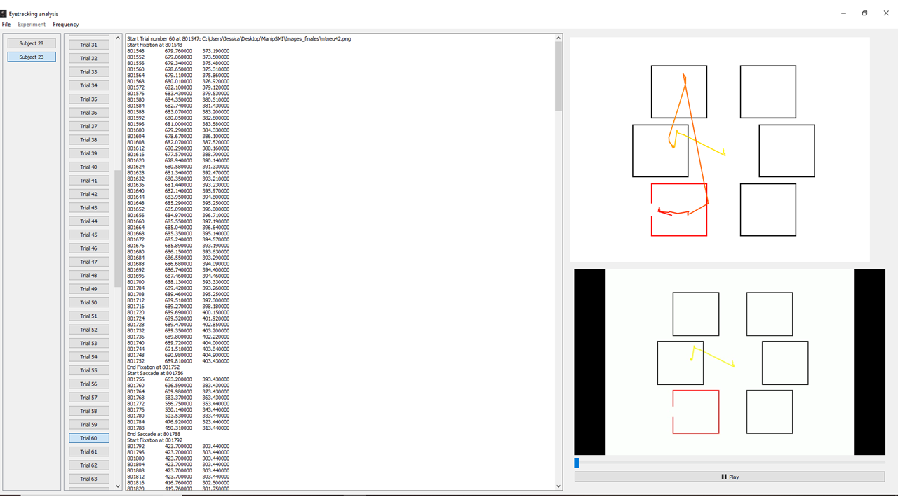

# Boogui

Boogui (named so after the great [Boo](https://baldursgate.fandom.com/wiki/Boo), who was always keen to "go for the eyes") is a software dedicated to viewing and processing gaze data recorded with [EyeLink](https://www.sr-research.com/) or [SMI](https://www.smivision.com/) eye trackers.



Boogui currently includes:
* Visualization of gaze data over time for each trial with target frames displayed
* A video view that plays back the trial with eye movements overlaid
* Filtering of SMI data based on fixation / saccade / blink parameters (e.g. duration). Compared to the default algorithm provided by SMI, it takes into account artifacts and allows to consider both dispersion and velocity for more accurate calculation of fixations.
* Output reports (.txt or .csv files) that can then be directly imported in statistical analysis packages such as Statistica or R for further processing.

Boogui currently implements experiments conducted during a thesis work conducted by Jessica Bourgin:
* Visual search
* Pro-saccade/anti-saccade ([Reference](https://www.researchgate.net/publication/325241657_Early_Emotional_Attention_is_Impacted_in_Alzheimer's_Disease_An_Eye-Tracking_Study))
* Gaze-contingent
* Saccadic choice

Any further experiment may be implemented upon request.

# Install

## Requirements

### On Windows

1. __[Python 3.6](https://www.python.org/downloads/)__

    This program requires Python 3.6. It was tested on versions 3.6.5 and 3.6.7.

2. __[PIPENV](https://docs.python-guide.org/dev/virtualenvs/)__

    Dependencies are handled by Pipenv. To install Pipenv:
```
pip install pipenv
```

If pip is not installed, download [get-pip.py](https://bootstrap.pypa.io/get-pip.py) and run:

```
python get-pip.py
```


### On Debian

1. __[Python 3.6](https://www.python.org/downloads/)__

    This program requires Python 3.6. It was tested on versions 3.6.5 and 3.6.7.

2. __[PIP](https://pypi.org/project/pip/)__

    Further dependencies will be handled by the Pipenv, which requires the PIP package manager of Python.
    To install pip:
```
apt install pip
```

3. __[PIPENV](https://docs.python-guide.org/dev/virtualenvs/)__

    Dependencies are handled by Pipenv. To install Pipenv:
```
pip install pipenv
```

4. __MISC__
For ubuntu: see https://github.com/pypa/packaging-problems/issues/211
apt install libqt5multimedia5-plugins
sudo rm /usr/local/lib/python3.6/dist-packages/PyQt5/Qt/plugins/mediaservice/libgstmediaplayer.so
sudo ln -s /usr/lib/x86_64-linux-gnu/qt5/plugins/mediaservice/libgstmediaplayer.so /usr/local/lib/python3.6/dist-packages/PyQt5/Qt/plugins/mediaservice/libgstmediaplayer.so

## Installation

Once the requirements are installed, the python environment is built by
```
pipenv install
```

# Usage

To launch the gui, type

```
make run
```
or
```
pipenv run python test_gui.py
```
